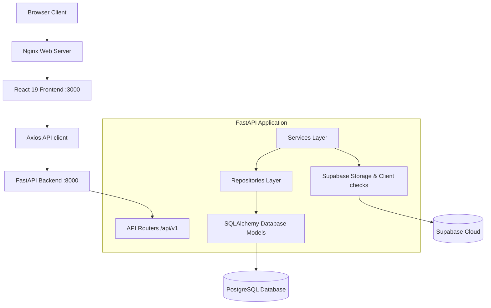

# Agentic RAG Platform Foundations

Welcome to the **Agentic RAG Platform**. This repository hosts the production-ready full-stack core, integrating a FastAPI backend, React 19 frontend, Supabase client layer, PostgreSQL abstractions, and containerized Docker environments. 

This foundation serves as a highly scalable, clean framework designed to allow subsequent integrations of LangGraph agentic workflows, Qdrant vector retrieval, Langfuse tracing, and LLM evaluation benchmarks without structural changes.

---

## 🏛️ Architecture Overview

The codebase is organized following **Clean Architecture** principles to enforce strict separation of concerns, modularity, and high testability.



### Stack Components

1.  **Frontend**: Built with **React 19**, **Vite**, **TypeScript**, **Tailwind CSS**, and **React Router DOM**. It is compiled and served in production using **Nginx**. It includes a background polling health supervisor checking connection status every 10 seconds.
2.  **Backend**: Built with **FastAPI**, **Pydantic v2**, and **SQLAlchemy 2.0**. Exposes structured logging, timing middlewares, and centralized exception handling.
3.  **Database**: Interfaced via **SQLAlchemy engine pools** and the official **Supabase Client**. Handles model structures for `Users` and `Documents`.
4.  **DevOps**: Orchestrated with **Docker** and **Docker Compose** on isolated bridging networks with persistent volume bindings.

---

## 📁 Repository Directory Structure

```
c:\kotha_pulse_folder\Unarchive\agenticRS\
├── app/                         # FastAPI Application Layer
│   ├── api/                     # Web controller layer
│   │   ├── middleware/          # Timing and context logging middleware
│   │   └── v1/                  # API v1 sub-routing
│   │       ├── endpoints/       # Controller endpoint handlers (health check)
│   │       └── router.py        # Master API v1 router
│   ├── core/                    # Core configuration and settings
│   │   ├── config.py            # Central Settings loading using Pydantic Settings
│   │   ├── exceptions.py        # Central exceptions mapping responders
│   │   └── logging.py           # Structured logger formatting contextvars
│   ├── db/                      # Connection layers
│   │   ├── session.py           # SQLAlchemy database session pool
│   │   └── supabase.py          # Supabase client and storage check hooks
│   ├── dependencies/            # Reusable dependency injection layers
│   │   ├── db.py                # Database session injectors
│   │   └── services.py          # Service injectors
│   ├── models/                  # Declarative database models (SQLAlchemy)
│   │   ├── base.py              # Base model registration
│   │   ├── user.py              # User schema specifications
│   │   └── document.py          # Document schema specifications
│   ├── repositories/            # Data access layer
│   │   └── base.py              # Reusable CRUD query wrapper
│   ├── schemas/                 # Input/Output validation definitions
│   │   └── health.py            # Health endpoint schemas
│   ├── services/                # Coordinate business operations
│   │   ├── base.py              # Reusable service interface
│   │   └── health.py            # Query latency checker service
│   └── utils/                   # Reusable functions and formatting utilities
│       └── formatters.py        # Unified envelope response formatters
├── database/                    # SQL Schema migration strategy folders
│   ├── migrations/              # DDL schema migrations
│   │   └── 01_initial_schema.sql
│   └── seeds/                   # Mock database seeds SQL
│       └── 01_seed_data.sql
├── frontend/                    # React 19 Frontend Web Project
│   ├── src/                     # React source files
│   │   ├── api/                 # Axios clients
│   │   ├── components/
│   │   │   ├── common/          # Reusable pastel theme UI components
│   │   │   └── layouts/         # Frame nesting structures (Sidebar, Navbar)
│   │   ├── contexts/            # Global contexts providers (HealthContext)
│   │   ├── pages/               # Page components (Dashboard, Settings, etc.)
│   │   ├── services/            # Client api integrations services
│   │   └── types/               # TypeScript interfaces
│   ├── Dockerfile               # Nginx multi-stage client compiler
│   └── nginx.conf               # React Router redirect configuration
├── tests/                       # Unit and integration test suite
├── Dockerfile                   # Python multi-stage backend compiler
├── docker-compose.yml           # Multi-container stack orchestrator
├── requirements.txt             # Backend requirements specifications
├── .env.example                 # Distributed settings template
└── .gitignore                   # Exclude list specifications
```

---

## ⚙️ Environment Configurations

Setup configurations inside a root `.env` file. You can bootstrap this from `.env.example`:

```bash
cp .env.example .env
```

Key environment parameters:

*   **DATABASE_URL**: SQLAlchemy-compatible connection string mapping to PostgreSQL.
*   **SUPABASE_URL**: Gateway URL for Supabase API interactions.
*   **SUPABASE_ANON_KEY**: Client-safe anonymous key for Supabase API queries.
*   **VITE_API_BASE_URL**: URL where the backend serves traffic (queried by frontend).

---

## 🚀 Getting Started

### Prerequisites
*   Python 3.11+
*   Node.js 20+
*   Docker & Docker Compose (preferred)

### Run with Docker Compose (Recommended)
You can launch the backend api, Postgres database, and the frontend web app simultaneously with:
```bash
docker-compose up --build
```
*   **Frontend**: served at `http://localhost:3000`
*   **Backend API**: served at `http://localhost:8000`
*   **Interactive Swagger Docs**: served at `http://localhost:8000/api/v1/docs`

---

## 🛠️ Local Development Setup

If running without Docker:

### 1. Launch Backend API
1.  **Navigate and initialize virtualenv**:
    ```bash
    python -m venv venv
    .\venv\Scripts\activate  # Windows (PowerShell)
    source venv/bin/activate  # macOS/Linux
    ```
2.  **Install dependencies**:
    ```bash
    pip install -r requirements.txt
    ```
3.  **Boot server**:
    ```bash
    python -m uvicorn app.main:app --reload
    ```

### 2. Launch Frontend Dev Server
1.  **Navigate and install**:
    ```bash
    cd frontend
    npm install
    ```
2.  **Boot server**:
    ```bash
    npm run dev
    ```
    The Vite development server will open at `http://localhost:3000` with hot reloading activated.

---

## 🧪 Testing

Run backend unit and integration test scripts using:
```bash
.\venv\Scripts\python -m pytest tests/
```

---

## 🗺️ Future Roadmap

*   **Phase 2**: Supposing Document Upload workflows, chunking strategies, and metadata indexing.
*   **Phase 3**: Integrating Vector Stores (pgvector / Qdrant) and hybrid retrieval matching pipelines.
*   **Phase 4**: Orchestrating agentic logic and multi-agent coordination states using LangGraph.
*   **Phase 5**: Establishing trace observability (Langfuse / Phoenix) and benchmarks evaluation scoring (Ragas).
