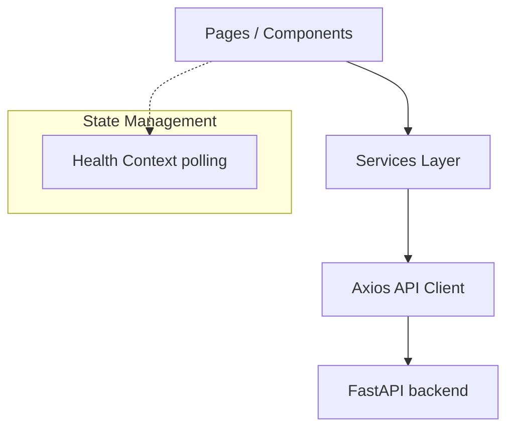

# Agentic RAG Platform Frontend Foundation

This is the production-ready React 19 + TypeScript + Vite frontend application for the Agentic RAG Platform. It provides a modular, scalable architecture organized under Clean Architecture principles to support future extensions (chat, document upload, LangGraph visualizers, traces, evaluation, dashboards, etc.).

---

## 🎨 Design & Aesthetic Guidelines

*   **Pastel Aesthetic**: Styled using a soft, clean pastel-toned color palette (light blues, purples, roses, ambers) and soft shadows (`shadow-soft`, `shadow-card`).
*   **Poppins Typography**: Conforms to the Poppins sans-serif font family.
*   **SVG Icons**: Avoid emojis. Use clean vector inline SVGs or Lucide-react components.
*   **Collapsible Responsiveness**: High support for mobile and desktop grids. Persistent sidebars slide away automatically on smaller layouts.

---

## 🏗️ Architecture Overview

The frontend architecture enforces a strict separation between UI presentation (components), business operations coordinator (services), communication adapters (api clients), and layout structures.



### Layer Responsibilities

1.  **Web Layout Layer (`src/components/layouts/`)**: Hosts structural wrapper outlines. Combines the collapsible responsive `Sidebar` and sticky top `Navbar` with the nested page `Outlet`.
2.  **API Client Layer (`src/api/`)**: Configures standard network clients. Holds custom timeout rules and request/response error capture interceptors.
3.  **Services Layer (`src/services/`)**: The only layer components can query to fetch data, separating UI rendering from API specifics.
4.  **Context Store Layer (`src/contexts/`)**: Implements React global state management (e.g. `HealthContext` tracking and background polling the API health states).
5.  **Page Components (`src/pages/`)**: Route landing frames (Dashboard, Settings, Traces, etc.).
6.  **Common UI (`src/components/common/`)**: Reusable primitives matching the pastel theme (Buttons, Inputs, Badges, Alert overlays, Modals, Spinners, Skeletons, Error plates, and Stat cards).

---

## 📁 Folder Structure Guide

```
frontend/
├── dist/                        # Compiled production bundle assets
├── public/                      # Static static asset resources
├── src/
│   ├── api/                     # Network connection adapters
│   │   └── apiClient.ts         # Base Axios setup with error interceptors
│   ├── components/
│   │   ├── common/              # Reusable UI primitive components
│   │   │   ├── Alert.tsx        # Styled feedback dialogs
│   │   │   ├── Badge.tsx        # Pastel tag labels
│   │   │   ├── Button.tsx       # Reusable button with spinner triggers
│   │   │   ├── Card.tsx         # Soft shadowed container card
│   │   │   ├── EmptyState.tsx   # Reusable placeholder for empty sets
│   │   │   ├── ErrorState.tsx   # Network failure banner with retry triggers
│   │   │   ├── Input.tsx        # Form validation input fields
│   │   │   ├── Modal.tsx        # Accessible overlay dialog boxes
│   │   │   ├── PageHeader.tsx   # Common Poppins layout header
│   │   │   ├── Skeleton.tsx     # Loading layout placeholders
│   │   │   └── Spinner.tsx      # Standard spinning loading indicator
│   │   └── layouts/             # Page nesting templates
│   │       ├── AppLayout.tsx    # Layout shell combining nav/sidebar
│   │       ├── Navbar.tsx       # Sticky top navigation bar
│   │       └── Sidebar.tsx      # Collapsible responsive sidebar
│   ├── contexts/                # Global contexts
│   │   └── HealthContext.tsx    # Global health and polling provider
│   ├── pages/                   # Landing page components
│   │   ├── Agent.tsx            # LangGraph agent workflow placeholder
│   │   ├── Dashboard.tsx        # Statistics and API health dashboard page
│   │   ├── Documents.tsx        # File ingestion manager placeholder
│   │   ├── Evaluation.tsx       # Benchmarks workspace placeholder
│   │   ├── Memory.tsx           # Context history memory placeholder
│   │   ├── NotFound.tsx         # Custom 404 page
│   │   ├── Observability.tsx    # Traces observer placeholder
│   │   ├── Retrieval.tsx        # Semantic search playground placeholder
│   │   └── Settings.tsx         # Platform settings configuration placeholder
│   ├── services/                # Coordinate business operations
│   │   └── dashboardService.ts  # Fetches health parameters from backend
│   ├── types/                   # TypeScript interfaces
│   │   └── health.ts            # Health check response schemas
│   ├── App.css                  # Blank stylesheet
│   ├── App.tsx                  # Main router definitions
│   ├── index.css                # Global Tailwind CSS and Poppins imports
│   └── main.tsx                 # Core React DOM bootstrap gateway
├── .env.example                 # Distributed settings template
├── tailwind.config.js           # Design system tokens configuration
├── postcss.config.js            # PostCSS plugin settings
├── tsconfig.json                # TypeScript global settings
├── tsconfig.app.json            # Application compile rules
└── vite.config.ts               # Bundling paths and dev server config
```

---

## ⚙️ Environment Configuration Guide

Variables are configured through `.env` files. In local environments, copy `.env.example` to `.env`:

```bash
# Backend API Base URL
VITE_API_URL=http://localhost:8000
```

*   **VITE_API_URL**: Endpoint where the backend server runs. Do not hardcode this value. Always fetch it dynamically from `import.meta.env.VITE_API_URL`.

---

## 🚀 Development Guide

### 1. Installation
Navigate into the `frontend/` directory and install dependencies:
```bash
cd frontend
npm install
```

### 2. Running Local Dev Server
```bash
npm run dev
```
*   The application will run locally at `http://localhost:3000`.

### 3. Production Build Compilation
Compile TypeScript and bundle code with Vite:
```bash
npm run build
```

---

## 🧪 Testing and Quality Checklist

Folders and dependencies are configured to easily extend testing later:
1.  **Component Tests**: Place inside `src/components/common/__tests__/` to verify unit actions.
2.  **Page/Integration Tests**: Place under a root `tests/` directory to verify router switches.
