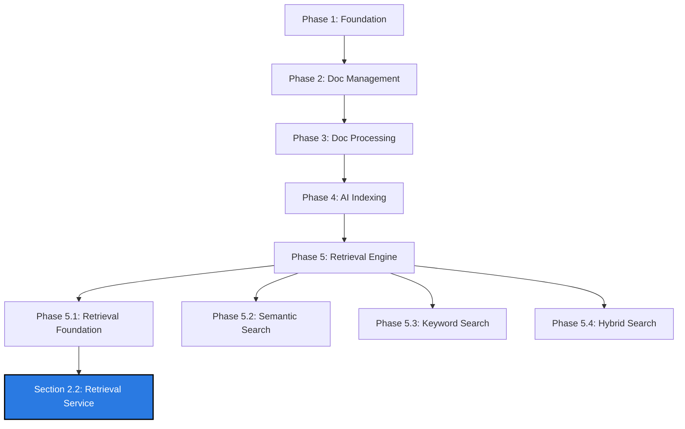

# Agentic RAG Platform Roadmap

Welcome to the **Agentic RAG Platform Roadmap**. This document tracks the implementation progress, architectural phases, and current work-in-progress components of the platform.

---

## 📊 High-Level Progress Overview

| Phase | Module / Milestone | Status | Details |
| :--- | :--- | :---: | :--- |
| **Phase 1** | Project Foundation | ✅ Completed | Backend, Frontend, Database, DevOps, Railway |
| **Phase 2** | Document Management | ✅ Completed | Upload/Download/Delete APIs, Supabase, Dashboard |
| **Phase 3** | Document Processing | ✅ Completed | Parsers (PDF, DOCX, TXT, MD), Metadata & Extraction |
| **Phase 4** | AI Indexing Pipeline | ✅ Completed | Intelligent Chunking, BGE-M3 Embeddings, Qdrant |
| **Phase 5** | **Retrieval Engine** | 🔄 **In Progress** | Split into Foundation, Semantic, Keyword, & Hybrid Search |
| **Phase 6** | LangGraph Agent | ⏳ Planned | Multi-agent orchestrations, conversational memory |
| **Phase 7** | Observability | ⏳ Planned | Langfuse, RAGAS evaluation framework, Prometheus |
| **Phase 8** | Production Optimization | ⏳ Planned | Redis caching, CI/CD, AWS/K8s, Performance Tuning |

---

## 📍 Current Work Status

We are currently in **Phase 5 — Retrieval Engine**, specifically working on **Phase 5.1 — Retrieval Engine Foundation** (building the underlying retrieval architecture).

---

## 🔍 Detailed Roadmap

### 📦 Phase 1 — Project Foundation
- [x] **Backend Foundation**: Set up FastAPI server structure, routing, and base configurations.
- [x] **Frontend Foundation**: Set up UI shell, components, and client-side setup.
- [x] **Database**: Configure PostgreSQL database schema, migrations, and connections.
- [x] **DevOps**: Write Dockerfile and docker-compose configurations.
- [x] **Railway Deployment**: Deploy the development/staging environment onto Railway.

### 📄 Phase 2 — Document Management
- [x] **Upload API**: Endpoint for uploading documents safely.
- [x] **Download API**: Endpoint for downloading original document copies.
- [x] **Delete API**: Endpoint to delete documents and clean dependencies.
- [x] **List Documents**: Paginated document listings.
- [x] **Supabase Storage**: Integration for cloud-based file storage.
- [x] **Document Dashboard**: Frontend dashboard view to manage uploads/downloads.

### ⚙️ Phase 3 — Document Processing
- [x] **PDF Parser**: Extract formatted text from PDF files.
- [x] **DOCX Parser**: Extract text and structures from Word documents.
- [x] **TXT Parser**: Clean plain-text parsing.
- [x] **Markdown Parser**: Read markdown files preserving document metadata.
- [x] **Text Extraction**: Unified pipeline to extract, clean, and store documents.
- [x] **Processing Dashboard**: Real-time parser status interface.
- [x] **Processing Metadata**: Save extracted parser metadata to the DB.

### 🧠 Phase 4 — AI Indexing Pipeline
- [x] **Intelligent Chunking**: Implement semantic/recursive text splitters.
- [x] **BGE-M3 Embeddings**: Local or API-driven embedding generation using BGE-M3.
- [x] **Qdrant**: Connect and initialize vector database schemas for document embeddings.
- [x] **Indexing Dashboard**: Admin panel showing vector count, indexing status, and storage size.
- [x] **Chunk Viewer**: UI utility to view specific document chunks.
- [x] **Embedding Dashboard**: Analytical panel for tracking vector metrics.

---

### 🗺️ Phase 5 — Retrieval Engine (CURRENT PHASE)

#### 🏗️ Phase 5.1 — Retrieval Engine Foundation
*Constructs the architectural backbone of the retrieval system without executing searches yet.*

##### Section 1: Architecture & System Design
- [x] Define Project Objectives & Scope
- [x] Document Existing & Proposed Clean Architecture
- [x] Model SOLID Principles & Module Boundaries
- [x] Define Scalability, Performance Goals, and Future Compatibility

##### Section 2: Retrieval Module
- [x] **Section 2.1 — Retrieval Module Architecture**: Layout folder structure, module boundaries, and internal workflows.
- [🔄] **Section 2.2 — Retrieval Service** `📍 YOU ARE HERE`
  - Responsibilities, Business Logic, Service Lifecycle, Dependency Injection, Service Contracts, Async Design, Stateless Design.
- [ ] **Section 2.3 — Retrieval Manager**: Context lifecycle, session lifecycles, and retrieval results management.
- [ ] **Section 2.4 — Interfaces & Contracts**: Provider, Repository, Service, and Strategy interfaces/contracts + DTOs.
- [ ] **Section 2.5 — Architecture Principles**: Concurrency, Thread Safety, Error Propagation, Scalability.

##### Additional Foundation Sections
- [ ] **Section 3 — Retrieval Pipeline**: Query lifecycle, execution pipeline stages, retries, and cancellation/timeouts.
- [ ] **Section 4 — Query Processing Engine**: Query normalization, synonym/acronym expansion, tokenization, intent detection, validation.
- [ ] **Section 5 — Retrieval Orchestration**: Orchestrator, Strategy pattern implementation, routing, provider selection.
- [ ] **Section 6 — Search Cache**: Cache layers, keys, TTL, cache invalidation, and Redis-ready designs.
- [ ] **Section 7 — Dependency Injection & Repository**: DI setup, Repository layer, provider registration, factory patterns.
- [ ] **Section 8 — Service Layer**: Context Builder, Response Builder, Metadata Manager, Confidence Calculator.
- [ ] **Section 9 — Logging & Error Handling**: Structured logging, metric collection, exception hierarchy, graceful degradation.
- [ ] **Section 10 — Testing & Deliverables**: Unit/Integration/Performance tests, Acceptance criteria, Production checklist.

#### 🔍 Phase 5.2 — Actual Semantic Search
- [ ] **Qdrant Search**: Integrate real vector lookups.
- [ ] **Top-K Selection**: Configure thresholding and result limiting.
- [ ] **Metadata Filtering**: Support filtering results by document/chunk metadata.
- [ ] **Batch Retrieval**: Support concurrent querying for multiple search sessions.

#### 🔤 Phase 5.3 — Keyword Search
- [ ] **Elasticsearch / Inverted Index**: Setup and integration.
- [ ] **BM25 Scoring**: Relevance scoring for exact keyword matches.
- [ ] **Exact Match / Token Matchers**: Optimization for specific acronyms or terminology.

#### 🎛️ Phase 5.4 — Hybrid Search
- [ ] **RRF (Reciprocal Rank Fusion)**: Fuse keyword and semantic search results.
- [ ] **Weighted Fusion**: Custom weight metrics per provider.
- [ ] **Duplicate Removal**: Clean results with overlapping text chunks.
- [ ] **Reranking**: Integrate cross-encoders for re-scoring the fusion results.
- [ ] **Source Attribution**: Map result segments directly back to the original documents.

---

### 🤖 Phase 6 — LangGraph Agent
- [ ] **Multi-Agent Flow**: Implement orchestrator-worker graph designs.
- [ ] **Dynamic Tool Calling**: Let agents choose when to search, index, or retrieve.
- [ ] **Memory & Context**: Conversational session memory tracking.

### 📈 Phase 7 — Observability
- [ ] **Langfuse Integration**: Trace query and generation chains.
- [ ] **RAGAS Evaluations**: Automated feedback loops for retrieval quality.
- [ ] **Prometheus Metrics**: Monitor search latency, request throughput, and token counts.

### 🚀 Phase 8 — Production Optimization
- [ ] **Redis**: High-speed caching for query vectors and outputs.
- [ ] **CI/CD Pipelines**: Automated linting, test suites, and deployments.
- [ ] **AWS & Kubernetes**: Scale components across containerized environments.
- [ ] **Performance Tuning**: Index optimizations, connection pooling, and optimized queries.

---

> [!NOTE]
> This roadmap is updated dynamically as each subtask is picked up, refined, and completed. Check back here for updates on the latest active task.
